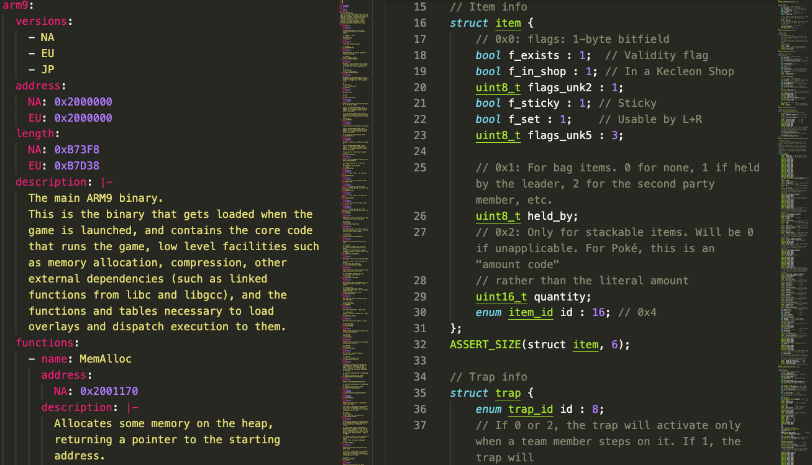
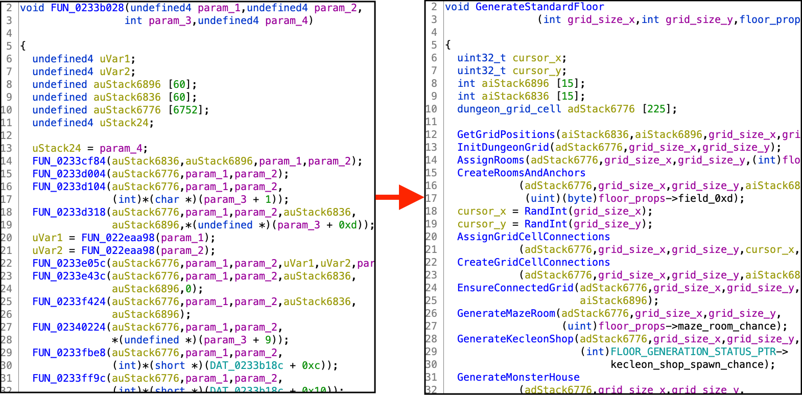
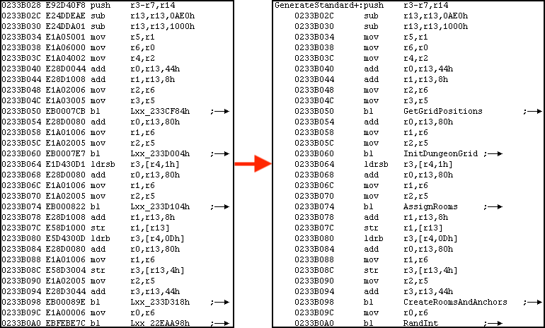

# pmdsky-debug

Debug information for reverse engineering _Pokémon Mystery Dungeon: Explorers of Sky_ (EoS), with accompanying documentation.

## What's in this repository?
The debug information in this repository is split into two complementary pieces:

- Symbol tables in the [`symbols/`](symbols) directory state where certain functions and interesting bits of data are located within the EoS binaries. Many of these symbols are accompanied by additional explanation about the inner workings of the game.
- C headers in the [`headers/`](headers) directory provide the exact memory layouts for various structures used by the game's code, with many of the fields labeled by name and with comments. The headers also provide function signatures with precise types for parameters and return values, and global variable declarations with precise types.

In addition, this repository contains some things in support of the debug information:

- Guides and documentation related to reverse engineering _Explorers of Sky_, particularly for beginners. These can be found in the [`docs/`](docs) directory.
- [`resymgen`](docs/resymgen.md), the Rust package used to transpile the symbol tables from YAML to other formats.
- Miscellaneous reverse engineering tools in the [`tools/`](tools) directory.

## What's _not_ in this repository?
This repository contains _annotations_ and _tools_ that are meant to accompany analysis of the _Explorers of Sky_ binaries, but does _not_ contain the binaries themselves. **It is up to you to obtain ROMs yourself.** The legal way is to dump the game files directly from a physical _Explorers of Sky_ cartridge that you own.

## Usage
The symbol tables and the C headers are simultaneously human-readable and machine-readable. This repository is designed to have various possible "modes of use":

- For EoS debug info, which can be directly imported into various reverse engineering tools. See [Using Debug Info from `pmdsky-debug`](docs/using-debug-info.md) for more information.
- Detailed technical documentation for EoS hacking, for both beginners and experienced hackers alike.
- An easy way to share EoS technical research in a standardized format. See [Contributing to `pmdsky-debug`](docs/contributing.md) for more information.
- For symbol tables and API headers that can be used to link against the EoS binaries.

The symbol tables and the C headers can be used as standalone references, or they can be used in conjunction. For example, if you are watching live memory while the game is running, you can use the symbol tables to find where a particular piece of data is in RAM. If that piece of data is a composite structure, you can then consult the C headers to understand what fields are contained in that structure, and exactly how the fields are laid out in memory.

If you are just reading documentation, this can be done directly in the browser. If you are importing debug info, you can always download the most up-to-date version of the symbol tables and C headers by checking the [latest release package](https://github.com/UsernameFodder/pmdsky-debug/releases/latest), which is updated automatically whenever the debug info is changed. The symbol table packages are split up by format (so you can download the one that fits with the tool you're using). The headers are distributed directly as source code, and come in two variants: one is the raw headers exactly as they are in the repository, while the other additionally contains function and global variable docstrings derived from descriptions in the symbol tables.

## A gentler introduction: Why does this repository exist?
Here's a bit more explanation about what this repository is for, if you're a beginner :). The goal of `pmdsky-debug` is to help people get a foothold in reverse engineering for EoS, and hopefully make it less daunting to get started. The more people there are to help out with research, the easier it becomes for everyone!

### A centralized resource for getting started
Reverse engineering can be a pretty difficult thing to break into because it requires multiple skills, all working together in tandem. Think of this repository as a centralized resource to make this journey as easy as possible. Besides assuming a basic knowledge of programming, it contains everything you need to start from scratch with reverse engineering EoS, all in a single place (either directly, or indirectly through targeted links). If you're completely new to reverse engineering, check out the [Other Resources](docs/resources.md) page for pointers to help you get started.

### A shared collection of pre-existing research
For a mostly unlabeled program like EoS, even once you have all the _skills_ required, there's still one large hurdle you need to overcome: figuring out where the code you care about is actually located within the binaries. This is just "encyclopedic" knowledge; for example, with the North American version of EoS, you either know that 0x208FEA4 in memory has a function that does integer division, or you don't. And if you don't know what the function at 0x208FEA4 does, then it'll be hard to figure out any code that calls into function at 0x208FEA4, and so on.

This makes it hard to go searching for "just one thing" about how the game works when you're just starting out (e.g., how damage calculation works in EoS), because you won't be able to figure out anything substantial without already having a solid foundation. There are a few different ways to build this foundation:

1. Getting information from someone else by sharing debug information in a machine-readable format.
2. Getting information from someone else through hand-written documentation, or by asking them directly.
3. Tedious reverse engineering work, starting with the simplest functions and building up a knowledge base from scratch.

The first method has many advantages: debug information is precise, and under ideal circumstances can be imported automatically into various reverse engineering tools. However, the EoS community has traditionally used the latter two methods due to a variety of [constraints](docs/resymgen.md#motivation). The last method is particularly unideal, since it leads to a lot of duplicated work among different community members.

This repository is an attempt to implement the first sharing method (machine-readable debug information), in a form that's still easy to make contributions to, and can also simultaneously serve as documentation. If you want to help out, [contributions](docs/contributing.md) are welcome!

## Pictures
### Technical documentation

### Ghidra with debug info

### No$GBA with symbol names

## Licensing
The overall `pmdsky-debug` project is licensed under [GPLv3](LICENSE.txt). However, the [symbols](symbols) and [C headers](headers) are additionally licensed under MIT; see the separate `LICENSE.txt` files in each directory. If you are exclusively using the symbols and/or C headers, you may choose to use them under either GPLv3 or MIT. If you are using `pmdsky-debug` as a submodule for your own project purely for the symbols and/or C headers, the dual license likewise applies, provided the symbols and/or C headers are the _only_ part of `pmdsky-debug` being used.
