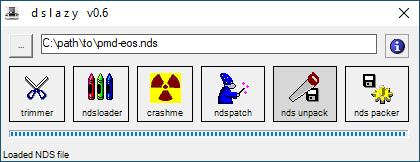
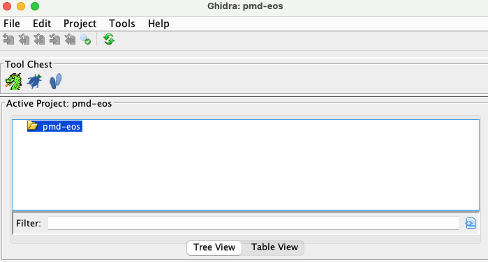
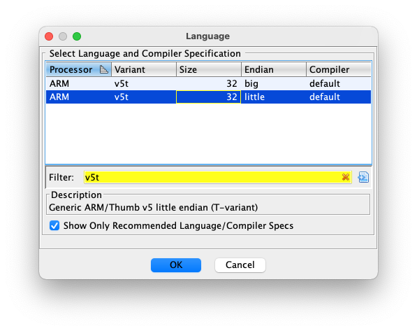
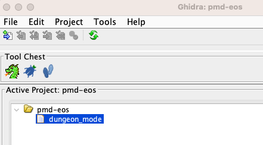
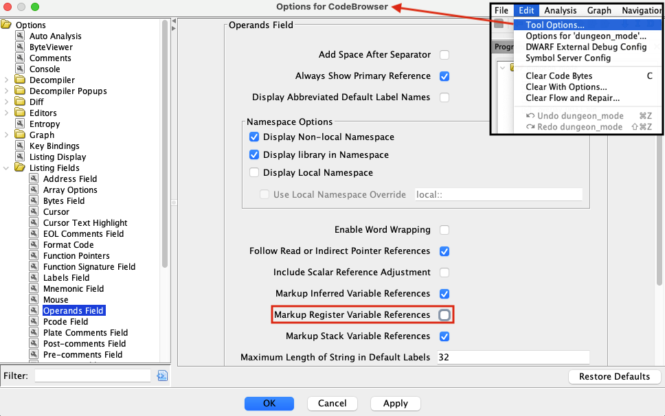
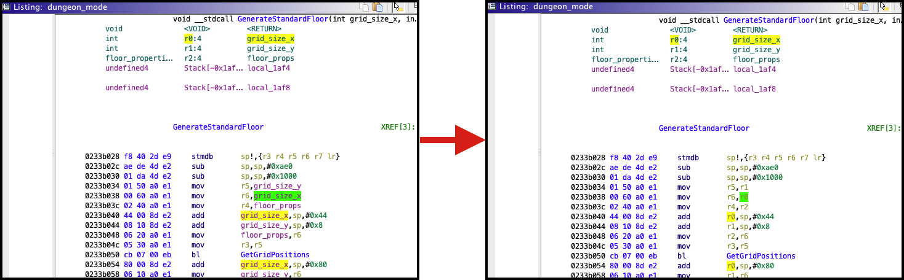

# Setting up Ghidra for _Pokémon Mystery Dungeon: Explorers of Sky_
Properly setting up a Ghidra environment for _Explorers of Sky_ can be tricky if you don't do it right. This guide walks you through the whole process, assuming you've already installed Ghidra and just have an EoS ROM file.

Steps in this guide were originally written for Ghidra 10.1.1, but shouldn't vary significantly between Ghidra versions. There's one exception: **Ghidra 10.2 had a bug that broke the ARMv5 disassembler, so don't use it.** However, the bug was fixed in Ghidra 10.2.1, so using this version or later should be fine.

Note: There is an easy-to-use Ghidra extension for loading Nintendo DS ROMs called [NTRGhidra](https://github.com/pedro-javierf/NTRGhidra). With NTRGhidra installed, you can just load the ROM (i.e., the `.nds` file) directly, then skip to the [Run analyzers](#run-analyzers) section. However, NTRGhidra loads all overlays at once, which reduces the quality of Ghidra's auto-analysis, particularly with cross-overlay branching. For this reason, the setup described below is still preferred when analyzing overlays in depth.

## Unpack the ROM
An NDS ROM (`.nds` file) is a [self-contained collection](https://problemkaputt.de/gbatek.htm#dscartridgeheader) that contains everything needed to run a game. This includes multiple binaries (for two separate CPUs!), an entire file system called the [NitroFS](https://problemkaputt.de/gbatek.htm#dscartridgenitroromandnitroarcfilesystems), metadata, and some other stuff. In order to do any reverse engineering, you'll first need to unpack this collection into its constituent parts.

There are various ways to unpack an NDS ROM. This guide outlines two simple methods.

### DSLazy (Windows)
1. Download [DSLazy](https://projectpokemon.org/home/files/file/2118-dslazy/) (the link is for v0.6) and extract the archive.
2. Run `dslazy.exe`.
3. In the UI, click the "..." button on the top-left, and select your ROM file in the file picker.
4. Once the NDS file has been loaded, click "nds unpack" to unpack the ROM.

   

5. When the unpacking has completed, the contents should open automatically in your file browser. If it doesn't, there should be an `NDS_UNPACK` folder in the same directory as `dslazy.exe`.
    - Unpacking shouldn't take more than a few seconds. I've found that on occasion the unpacking will finish, but the UI will still look like the operation hasn't completed. If you find yourself waiting too long, check the contents of the `NDS_UNPACK` folder, and if everything is there, you can just proceed to the next step without waiting longer.
6. The `NDS_UNPACK` folder (and its subfolders) should contain all the unpacked binaries (and other files in the NitroFS) for your reverse engineering use.

### `ndstool` (macOS, Linux, any other *nix environment)
1. Download the [latest `ndstool` release](https://github.com/devkitPro/ndstool/releases/latest) and extract the archive. Alternatively, you can clone the repo if you want, but you'll need to have [`automake`](https://www.gnu.org/software/automake/) installed to generate the build scripts (run `./autogen.sh` within the repo root directory before proceeding to the next step).
2. The release package contains build and installation instructions in the `INSTALL` file. To summarize, open a terminal, `cd` into the extracted directory, and run `./configure && make && make install` (you might need to do `sudo make install` as the last step). The install step should place `ndstool` somewhere in your `PATH`, so you should be able to run the `ndstool` command to print usage instructions.
3. Create a directory to hold the unpacked ROM contents and `cd` into it (e.g., `mkdir NDS_UNPACK && cd NDS_UNPACK`). Then run the following command (filling in the last argument with the path to your ROM file): `ndstool -9 arm9.bin -7 arm7.bin -y9 y9.bin -y7 y7.bin -d data -y overlay -t banner.bin -h header.bin -x </path/to/ROM>`. This is essentially the same thing DSLazy does on Windows, and should unpack all the binaries (and other files in the NitroFS) for your reverse engineering use.

## Create the project
Launch Ghidra and create a new project.

1. File > New Project...
2. Select "Non-Shared Project"
3. Pick a folder where you want to save your project, and give the project a name (it can be anything you want, this example will use "pmd-eos"). Once you click "Finish" you should see your new project open in the UI:

   

## Load binaries
Load the binaries you care about from the unpacked ROM.

You will always start with the main ARM9 binary, which is usually named `arm9.bin` after unpacking (but it could be something else). This binary is the first one loaded when the game starts, and remains loaded as long as the game is running. After loading the ARM9 binary you'll likely want to load additional [overlays](overlays.md) depending on what part of the game you're interested in reverse engineering.

1. File > Import File...
2. Locate `arm9.bin` (or equivalent) in your file system and select it to import.
3. Fill in the appropriate configuration options:
    1. The format should be "Raw Binary"
    2. The language should be "ARM:LE:32:v5t:default" (To elaborate, the [Nintendo DS](https://en.wikipedia.org/wiki/Nintendo_DS) has an [ARM946E-S](https://en.wikipedia.org/wiki/ARM9#ARM9E-S_and_ARM9EJ-S) CPU which uses the ARMv5TE microarchitecture, and everything in EoS is [little-endian](https://en.wikipedia.org/wiki/Endianness)). You can select the right language by clicking the "..." button and locating the appropriate entry in the table (you can narrow things down nicely by setting "v5t" as the filter). Make sure you select the _little-endian_ row!

       

    3. The destination folder can be left as the default (which should be the top-level folder in your new project).
    4. The program name can be anything. The default will just be the binary file name, but I like to use something more general since this isn't the only file that'll be loaded in the final setup (for example, "dungeon_mode" if I'm setting up dungeon mode).
    5. Hit the Options... button to open the advanced options:
        1. The block name can be anything. I like to use the name of the binary here (e.g., "arm9.bin").
        2. The base address should be 02000000. This is the memory address (in hexadecimal) where the game loads the ARM9 binary. **If you don't set this properly, Ghidra's auto-analysis will be of poor quality.** (This is because the binaries have hard-coded addresses that assume the starting address is 0x2000000)
        3. The file offset and length can be left as the defaults (the full binary file will be loaded).
        4. The checkboxes related to "Processor Defined Labels" can be left as the defaults (they should be checked).
4. After importing, open the program in the code browser by double clicking on it.

   

5. Once the code browser opens, you might be prompted to analyze the binary. I usually select "No" at this stage since the overlays haven't been loaded yet (we'll run analysis later), but hitting "Yes" is harmless and will just run a partial analysis.
6. In the code browser, add the [overlays](overlays.md) you care about one-by-one:
    1. File > Add To Program..., then locate and select an overlay file (e.g., overlay 29 for dungeon mode, usually called `overlay_0029.bin`). Note that using "Import File..." (wrong!) will open a separate workspace for the new file, which isn't what we want.
    2. Fill in the appropriate configuration options. Most of the configuration should be filled in for you this time. The only things you need to change are under the advanced options (the "Options..." button)
        1. I recommend _not_ checking the "Overlay" checkbox. Despite the name, I've found that this at best doesn't add anything (we're already manually managing which overlays to load anyway), and at worst messes up auto-analysis.
        2. The block name can be anything. I like to use the overlay file name (e.g., "overlay_0029.bin").
        3. The base address should be the load address for the overlay (as hexadecimal, without the "0x" prefix). You can find these at the top of the [`pmdsky-debug` symbol file](../symbols) for the overlay under the top-level `address` field (e.g., overlay 29 is loaded at 0x22DC240 in the North American version). Similarly to the ARM9 binary, **if you don't set this properly, Ghidra's auto-analysis will be of poor quality**.
        4. Leave the rest of the options as the defaults.
    3. Repeat the above steps for all the overlays you care about. For example, for analyzing dungeon mode you'll want to load overlays 10, 29, and 31.

## Run analyzers
Once all the binaries have been loaded at the appropriate memory addresses, run the analyzers. This might take a while (you can watch the progress bar on the bottom-right of the code browser window).

1. In the code browser, press the 'a' key, or go to the menu and select Analysis > Auto Analyze '`<project>`'...
2. You can play around with the analyzers to run, but I usually leave things as the defaults and just click "Analyze".

## Import debug info
See the appropriate section of [Using Debug Info from `pmdsky-debug`](using-debug-info.md#ghidra).

## (Optional) Disable register variable names in disassembly
By default, if Ghidra has variable names in the decompiled code (it usually does), it will try to apply them to the disassembly as well, replacing raw register names in instruction operands with the corresponding variable names. With ARM assembly, this is generally unhelpful, since registers are commonly repurposed in the middle of a function and might not always map to a single logical variable. While it's ultimately up to preference, I recommend disabling this behavior so that the disassembly just shows the bare register names. This makes reading the assembly code more straightforward.

To do this, select Edit > Tool Options..., navigate to Options > Listing Fields > Operands Field, uncheck the box labeled "Markup Register Variable References", then hit "Apply".

   

With this option disabled, the disassembler will still be _aware_ of variable names from the decompiler, but it won't display them in place of register names in the assembly code.

   

## Reverse engineer!
You're now ready to actually reverse engineer! Ghidra has [built-in tutorials](https://github.com/NationalSecurityAgency/ghidra/tree/master/GhidraDocs/GhidraClass) (here's an [HTML preview of the beginner class](https://htmlpreview.github.io/?https://github.com/NationalSecurityAgency/ghidra/blob/stable/GhidraDocs/GhidraClass/Beginner/Introduction_to_Ghidra_Student_Guide.html)) that teach you how to use the application. Also see [Other Resources](resources.md) for some links if you're new to reverse engineering, and the Ghidra section of [Using Debug Info from `pmdsky-debug`](using-debug-info.md#ghidra) for some targeted tips.
