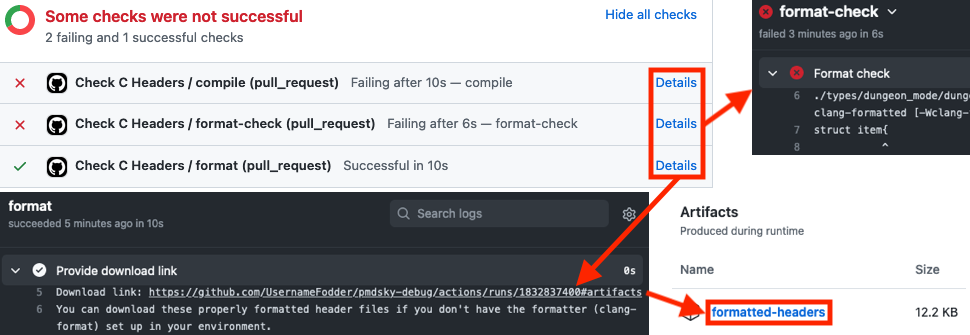

# C Headers
- [C Headers](#c-headers)
  - [Working with the C headers](#working-with-the-c-headers)
    - [What is a struct?](#what-is-a-struct)
    - [What is an enum?](#what-is-an-enum)
    - [Endianness](#endianness)
    - [Bitfield packing](#bitfield-packing)
    - [Struct packing](#struct-packing)
    - [Pointer size](#pointer-size)
    - [Enum size](#enum-size)
    - [Version differences](#version-differences)
  - [Contributing](#contributing)
    - [Provide explicit struct sizes with `ASSERT_SIZE` when possible](#provide-explicit-struct-sizes-with-assert_size-when-possible)
    - [Add comments for types and fields](#add-comments-for-types-and-fields)
    - [Use meaningful types](#use-meaningful-types)
    - [Follow style conventions](#follow-style-conventions)
  - [Local development environment](#local-development-environment)
  - [Licensing](#licensing)

The C headers in this directory contain _type information_, including struct definitions, enum definitions, function signatures, and global variable declarations. They also contain _documentation_ in the form of comments. They don't contain "code" in the sense of executable instructions (that would be in the realm of a decompilation project).

The top-level entrypoint for the headers is [`pmdsky.h`](pmdsky.h) (there are also version-specific variants, named `pmdsky_*.h`, which are wrappers around `pmdsky.h`). These headers are real, valid C that can be compiled with standard tools (`gcc` or `clang`). They also use a subset of C supported by Ghidra's C parser with no additional environment configuration (so no GCC extensions, etc.). This makes them versatile and compatible with the mature ecosystem of tools available for C programming.

## Working with the C headers
This section is geared towards beginners, and aims to ensure a baseline level of knowledge so that the C headers can be used as documentation by experts and non-experts alike. It describes some of the basics about C types in relation to raw memory layouts, and is not totally related to _Explorers of Sky_ itself. If you already have a good grasp on the fundamentals, this section can be skipped or skimmed.

### What is a struct?
In C, a struct is just a way to group together related pieces of data. Structs can be used in various contexts, from runtime variables tracking the game's state to file formats containing static game data. A lot of documentation in the PMD community has traditionally described data structures in a format like this (this example is from the [Project Pokémon docs](https://projectpokemon.org/home/docs/mystery-dungeon-nds/item_pbin-file-format-r52/)):

| Offset | Length | Type   | Name       | Description                                                               |
|--------|--------|--------|------------|---------------------------------------------------------------------------|
| 0x00   | 2      | uint16 | Buy Price  | Price to pay for the item when purchased from a shop.                     |
| 0x02   | 2      | uint16 | Sell Price | Price a shop will offer for the item.                                     |
| 0x04   | 1      | uint8  | Category   | Used for sorting items, and possibly to determine the way the item works. |
...

As a C struct, we could describe the same data like this:
```c
struct item_data_entry {
    // 0x0: Price to pay for the item when purchased from a shop.
    uint16_t buy_price;
    // 0x2: Price a shop will offer for the item.
    uint16_t sell_price;
    // 0x4: Used for sorting items, and possibly to determine the way the item works.
    // (could also do, e.g., `enum category_id category` - more on that later)
    uint8_t category;
    ...
};
```
A big advantage of using C structs is that they're machine-readable. Not only does this mean that layout specifications are _compilably_ precise, it also means that we can import them into tools such as Ghidra to improve the debugging experience.

One limitation of C structs is that variable-length data is difficult to represent. Variable-length fields used semi-frequently in the game's data files. Since data files are static, one easy workaround is to define an array of raw bytes for the part of the structure that has variable-length data. Fortunately, since EoS was almost certainly written in C, variable-length constructs are rarely used in the actual runtime code.

### What is an enum?
An enum is a way to assign meaningful labels to a group of raw integer values. For example, every Pokémon species in EoS is identified by a "species code". Bulbasaur is 1, Ivysaur is 2, Venusaur is 3, etc. Expressed as an enum:
```c
enum monster_id {
    MONSTER_NONE = 0,
    MONSTER_BULBASAUR = 1,
    MONSTER_IVYSAUR = 2,
    MONSTER_VENUSAUR = 3,
    ...
};
```
Enum definitions allow us to exhaustively list every possible value for a particular context (e.g., all species codes) alongside meaningful labels. Enums can also be used as types in struct fields and function parameters, which allows headers to convey more information than with plain integer types, and also allows tools like Ghidra to resolve raw values into enum labels for easier debugging.

### Endianness
EoS uses [_little-endian_](https://en.wikipedia.org/wiki/Endianness) byte ordering for (almost) everything (like most other ARM architectures). This means that any integer type larger than a single byte is stored _least-significant byte first_ (this might seem "backwards" to beginners, but it has some advantages). For example, let's say we have a struct like this:
```c
struct little_endian {
    uint32_t four_bytes;
    uint16_t two_bytes;
    uint8_t one_byte;
};
```
And let's say we have a realization of the struct like this (in practice you'd probably be looking in a RAM viewer while the game is running):
```c
// a particular instance of the struct
struct little_endian example = {
    .four_bytes = 0x12345678,
    .two_bytes = 0xABCD,
    .one_byte = 0xEF,
};
```
Then the actual layout in memory (in typical hexadecimal notation) would look like this:
```
78 56 34 12 CD AB EF
───────────╫─────╫───
     ▲        ▲    ▲
     │        │    └── example.one_byte
     │        └─────── example.two_bytes
     └──────────────── example.four_bytes
```

### Bitfield packing
Bitfields are packed _least-significant bit first_, similar to little-endian integers. For example, let's say we have a struct like this:
```c
// A 1-byte bitfield
struct flags {
    uint8_t val : 4;
    bool f4 : 1;
    bool f5 : 1;
    bool f6 : 1;
    bool f7 : 1;
};
```
And let's say we have a realization of the struct like this (in practice you'd probably be reading code applying a mask to the aggregate bitfield, or looking in a RAM viewer while the game is running):
```c
struct flags example = {
    .val = 13    // 0b1101
    .f4 = false, // 0b0
    .f5 = true,  // 0b1
    .f6 = false,
    .f7 = true,
};
```
Then the actual byte value would be `0b10101101 == 0xAD`. Broken down in more detail:
```
{ 1   0   1   0   1101 } == 0xAD
  f7  f6  f5  f4  val
```

### Struct packing
For technical reasons, C struct fields are normally [aligned](https://en.wikipedia.org/wiki/Data_structure_alignment) according to the natural alignment of their types, with extra bytes of padding implicitly inserted to fill any gaps created by alignment. In packed structs, fields are "packed together" exactly as defined, with no padding bytes inserted in between.

All structs in the C headers are naturally aligned by default. However, for clarity, _implicit padding is not allowed_. You must explicitly insert padding bytes if desired. The compiler will enforce this restriction. If a struct cannot be represented with natural alignment, you can pack it with a specified alignment by wrapping it with `#pragma pack` directives (use `push` and `pop` to confine the packing to just the struct of interest). For example:

```c
// This struct is 8 bytes wide.
//
// {.one_byte = 0x11, .two_bytes = 0x2222, .four_bytes = 0x44444444} in memory:
//   11 __ 22 22 44 44 44 44
struct implicit_padding {
    uint8_t one_byte;
    // One byte of implicit padding here! This is not allowed!
    uint16_t two_bytes;
    uint32_t four_bytes;
};

// This struct is also 8 bytes wide, but explicitly padded.
//
// {.one_byte = 0x11, .two_bytes = 0x2222, .four_bytes = 0x44444444} in memory:
//   11 __ 22 22 44 44 44 44
struct explicit_padding {
    uint8_t one_byte;
    uint8_t _padding;
    uint16_t two_bytes;
    uint32_t four_bytes;
};

// This struct is 7 bytes wide, and has no padding.
//
// {.one_byte = 0x11, .two_bytes = 0x2222, .four_bytes = 0x44444444} in memory:
//   11 22 22 44 44 44 44
#pragma pack(push, 1) // Align all members to a 1-byte boundary
struct packed {
    uint8_t one_byte;
    uint16_t two_bytes;
    uint32_t four_bytes;
};
#pragma pack(pop) // Go back to the default packing behavior
```

### Pointer size
EoS binaries are compiled for ARM9 and ARM7, which are 32-bit processor families. This means that all pointers types are 4 bytes wide (and [little-endian](#endianness)).

### Enum size
Enums are always 4-byte integers. If you want to embed a smaller-sized enum within a struct, you should either wrap it in an auxiliary struct or make it a bitfield, depending on the situation. An auxiliary struct is preferred when the desired width is an exact number of bytes, whereas an enum bitfield is the only option for fields less than 8 bits wide.

All headers have access to the convenience macros `ENUM_8_BIT` and `ENUM_16_BIT` (defined in [`pmdsky.h`](pmdsky.h)). These define 1-byte and 2-byte auxiliary structs from an enum automatically when wrapped in packing pragmas (the pragmas are required because the C standard does not allow preprocessor directives such as `#pragma` within macros). For example:

```c
// This is 4 bytes wide, even though it only goes up to a value of 2.
enum four_byte_enum {
    LABEL_0 = 0,
    LABEL_1 = 1,
    LABEL_2 = 2,
};

// This defines a 1-byte `struct four_byte_enum_8` struct
// with a single `val` field of type `enum four_byte_enum`
#pragma pack(push, 1)
ENUM_8_BIT(four_byte_enum);
#pragma pack(pop)

// This defines a 2-byte `struct four_byte_enum_16` struct
// with a single `val` field of type `enum four_byte_enum`
#pragma pack(push, 2)
ENUM_16_BIT(four_byte_enum);
#pragma pack(pop)

// This whole struct is 4 bytes wide.
struct two_byte_struct {
    struct four_byte_enum_16 two_byte_field;
    struct four_byte_enum_8 array_of_bytes[2];
};
```

_Note_: Technically enum size is a detail that depends on the C compiler implementation, but in practice, most standard compilers targeting standard platforms represent enums as 4 bytes by default, including Ghidra's C parser. Both `gcc` and `clang` support the `-fshort-enums` option, but Ghidra's C parser doesn't, so auxiliary structs and bitfields are a sane and portable way to represent smaller-sized enums in struct fields.

### Version differences
Occasionally, the C headers may need to define things differently between different game versions. For example, a struct in the North American version of the game might have a field that doesn't exist in the Japanese version of the game, or an enum may have an entirely different set of values.

In these cases, you can use the `PMDSKY_VERSION` preprocessor variable alongside the versions defined in [`versions.h`](versions.h) to define different C header content for different versions. For example:

```c
struct version_dependent_struct {
    uint32_t common;

#if PMDSKY_VERSION == PMDSKY_EU
    // This field only exists in the EU version
    uint32_t eu_only_field;
#endif

#if PMDSKY_VERSION == PMDSKY_JP
#else
    // This field exists in the NA and EU versions, but not the JP version
    uint32_t not_in_jp;
#endif
};
// If the size varies by version, you'll also need a version-dependent ASSERT_SIZE.
// Note that a more compact way to type this would be to make only the arguments to
// ASSERT_SIZE conditional. This would be valid C, but it unfortunately gives the
// Ghidra C parser trouble, so stick to writing the full ASSERT_SIZE for each version.
#if PMDSKY_VERSION == PMDSKY_NA
ASSERT_SIZE(struct version_dependent_struct, 8);
#elif PMDSKY_VERSION == PMDSKY_EU
ASSERT_SIZE(struct version_dependent_struct, 12);
#elif PMDSKY_VERSION == PMDSKY_JP
ASSERT_SIZE(struct version_dependent_struct, 4);
#endif

enum version_dependent_enum {
#if PMDSKY_VERSION == PMDSKY_NA
    // Enum levels in the NA version
    LABEL_ABC = 0,
    LABEL_DEF = 1,
#elif PMDSKY_VERSION == PMDSKY_EU
    // Enum levels in the EU version
    LABEL_123 = 0,
    LABEL_456 = 1,
#elif PMDSKY_VERSION == PMDSKY_JP
    // Enum levels in the JP version
    LABEL_X = 0,
    LABEL_Y = 1,
#endif
};
```

## Contributing
In addition to the concepts discussed in the [previous section](#working-with-the-c-headers), there are a few more conventions to follow when contributing to the C headers.

### Provide explicit struct sizes with `ASSERT_SIZE` when possible
If you add new structs, add an `ASSERT_SIZE` statement after the struct definition. This gives readers an explicit size for structs, and also guards against mistakes by making sure structs are sized as intended (both when they're added and if there are any changes down the line). Size assertions will be checked automatically (via GitHub Actions) when you create or edit a pull request.

All headers have access to the `ASSERT_SIZE` macro (it's defined in [`pmdsky.h`](pmdsky.h)). Here's an example size assertion:
```c
ASSERT_SIZE(struct some_20_byte_struct, 20);
```

### Add comments for types and fields
For the benefit of readers using the C headers as a reference, add comments for known structs, enums, and struct fields. For fields in large structs, include the hex offset, since it's useful to have when viewing RAM directly and isn't always easy to tell just from the struct definition.

### Use meaningful types
It benefits everyone to use types with a clear meaning for struct fields and function parameters:

- For integer values, prefer the standard fixed-width integer types (1-byte signed `int8_t`, 1-byte unsigned `uint8_t`, etc.). The typical 4-byte `int` type is an exception if you don't want to type out `int32_t`. If you aren't sure about signedness, just pick one; it's not that important in most cases.
- Prefer the 1-byte `bool` type for binary flags if possible.
- If you don't know the type of a struct field or function parameter, use the Ghidra-style `undefined` (alias for `undefined1`), `undefined2`, and `undefined4` types.

All headers have access to the above standard types (they're defined in [`pmdsky.h`](pmdsky.h)).

### Follow style conventions
Some formatting conventions are enforced by the formatter. You'll be able to see if your changes are properly formatted when you create or edit a pull request on GitHub, and you'll even be able to download corrected files if there are any formatting issues. This is all automated using GitHub Actions so you don't need to install anything on your end, but if you would prefer to do things yourself, you can also set up a [local dev environment](#local-development-environment).



Naming conventions are as follows:

- Function and data names should exactly match their corresponding [symbol](../symbols) entries, which are `PascalCase` and `SCREAMING_SNAKE_CASE`, respectively.
- Enum labels (the actual values, not the enum name itself):
    - Use `SCREAMING_SNAKE_CASE`
    - All labels within an enum should share a common prefix. For example, `enum item_id` labels are all prefixed by `ITEM_`.
    - Numeric values for labels should be explicit. For example, use the explicit `ITEM_ORAN_BERRY = 70` rather than the implicit `ITEM_ORAN_BERRY`. This makes it easier for readers to use enum definitions as references.
- Use `snake_case` for everything else, including the names of structs, struct fields, enums, unions, and function parameters.

## Local development environment
**This is not required to contribute**. However, you might find that setting this up (either partially or fully) makes editing the C headers easier. The development environment uses standard Unix C tooling (Windows environments such as [MinGW](https://www.mingw-w64.org/) should also work), and you can pick and choose which to install to give you access to different commands:

- [GNU Make](https://www.gnu.org/software/make/) will allow you to run `make` commands. If you have the other tools but not `make`, you can just copy commands from the [Makefile](Makefile) and run them yourself.
- Either [`clang`](https://clang.llvm.org/) or [`gcc`](https://gcc.gnu.org/) will allow you to run compiler checks (syntax and size assertions) via `make` or `make headers`.
- [`clang-format`](https://clang.llvm.org/docs/ClangFormat.html) (often comes included when you install [`clang`](https://clang.llvm.org/)) will allow you to run the formatter via `make format` (it also requires the `find` and `xargs` Unix utilities). With `clang-format` version 10+ you can also run the formatter in check mode via `make format-check`.
- [Python 3](https://www.python.org/) (invokable with the `python3` command) with [PyYAML](https://pyyaml.org/) installed (`pip3 install pyyaml`) will allow you to run synchronization checks between functions and data symbols defined in the C headers and those defined in the corresponding [symbol](../symbols) files, via `make symbol-check`.

## Licensing
The `pmdsky-debug` C headers are dual-licensed under [GNU GPLv3](../LICENSE.txt) or [MIT](LICENSE.txt). If you are using the C headers in your own project, you may choose to use them under either license.
