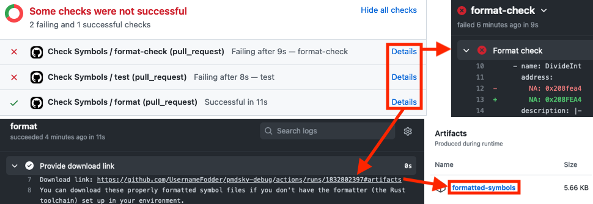

# Symbol Tables
- [Symbol Tables](#symbol-tables)
  - [Files](#files)
  - [Contributing](#contributing)
    - [Some fields are optional (but more is better)](#some-fields-are-optional-but-more-is-better)
    - [Functions: provide docstrings when possible](#functions-provide-docstrings-when-possible)
    - [Data: specify complex types when possible](#data-specify-complex-types-when-possible)
    - [Use address lists for duplicated symbols](#use-address-lists-for-duplicated-symbols)
    - [Follow style conventions](#follow-style-conventions)
  - [Local development environment](#local-development-environment)
  - [Licensing](#licensing)

A "symbol" is a name for a specific offset within a binary. Having descriptive symbol names often dramatically improves the readability of assembly instructions and decompiled code. This directory contains catalogs of symbols within the _Explorers of Sky_ binaries. They use the human-and-machine-readable [YAML](https://en.wikipedia.org/wiki/YAML) format, so they can be used both as documentation and for import into various tools.

Each file defines one or more _blocks_, which are collections of symbols. Both a block and its contained symbols have one or more addresses (and an optional length) that state where they are in memory, along with a name and (optional) description to tell you what they're for. Symbols are listed by _memory address_ when loaded in-game, since this is typically more useful than direct offsets into the binary files; you can take a symbol's address and subtract the address of its block to get the symbol's offset within the binary.

Files can have two types of symbols: functions and data (data = everything that isn't a function); each symbol type gets its own list within a YAML file. This distinction is meaningful for certain tools such as Ghidra.

Additionally, blocks can define _subregions_. A subregion is a separate file split off from the block's parent file that contains a subset of symbols within some address range. A subregion's symbols still logically belong to the parent block, but splitting them into a separate subregion can help with organization.

## Files
- [`arm9.yml`](arm9.yml) (and subregions within [`arm9/`](arm9/)) contains all symbols in EoS's main ARM9 binary (usually called `arm9.bin`).
- [`arm7.yml`](arm7.yml) contains all symbols in EoS's secondary ARM7 binary (usually called `arm7.bin`).
- The `overlay*.yml` files (and subregions within `overlay*/`) contain all symbols in their respective [overlays](../docs/overlays.md).
- [`ram.yml`](ram.yml) contains symbols that don't fall within any of the binaries themselves (such as various heap-allocated structures), but are still useful to know about.
- [`literals.yml`](literals.yml) is a special file for recording the addresses of interesting values that are _arguments for a specific instruction_ rather than standalone data. These "literals" (or "immediate values" in assembly jargon) are often embedded within basic instructions like `mov`, `add`, and `sub`, and hence aren't real symbols, but may be useful regardless. For example, the starting levels for the hero and partner are encoded as literals within the ARM9 binary.

## Contributing
If you want to add new symbols (or modify existing ones), all you have to do is edit the appropriate YAML files (although you might also want to add [new types](../headers/README.md#contributing) alongside new symbols, especially for functions). The YAML specification for symbol files should hopefully be intuitive to understand, but you can see the full specification with examples in the [`resymgen` README](../docs/resymgen.md#the-resymgen-yaml-specification).

The following sections describe a few principles and conventions to follow when adding new symbols.

### Some fields are optional (but more is better)
There are only two things that are _absolutely necessary_ for a symbol to have: a name, and an address for at least one version (NA, EU, or JP). Everything else is optional, which allows for cases where you might not know what to fill in. However, the more the better! The following fields are not required for a symbol, but are nice to have:
- Descriptions
- Addresses for multiple versions
- Lengths for data symbols

### Functions: provide docstrings when possible
If you know some or all of the input/output parameters for a function, list them in the description as a docstring! This is a precise way to convey lots of information to future readers. Here's an example description field for the sake of formatting standardization (pick and choose what makes sense for your case):

```yml
description: |-
    Brief overview of what the function does.

    Elaboration or additional information to explain aspects of the function in more detail.

    r0: description of the first input parameter (register 0)
    r1: ? (for parameters in the middle of the list that you aren't sure about)
    ... 
    r3: description of the fourth input parameter
    stack[0]: description of the fifth input parameter
              (EoS uses the stack for parameters after the first 4)
    stack[1]: description of the sixth input parameter
    ...
    return: description of the return value, if any

    (If a function has no inputs or outputs, put "No params." where the parameter list would go)
```

### Data: specify complex types when possible
If a data symbol has a complex structure that you know something about, specify the format in the description! You can do this in one of two ways:
1. (Preferred) Specify a type from the C headers (you might need to [add a new one](../headers/README.md#contributing)). This gives an unambiguous specification for the data layout (and also allows people to apply the C type to the data symbol in tools like Ghidra).
2. Describe the data layout in words.

Here's an example description field for the sake of formatting standardization:

```yml
description: |-
    Brief description of the data.

    Elaboration, additional information, and description of the data format, if relevant.

    type: <some C type signature> (e.g., struct some_struct[256])
```

### Use address lists for duplicated symbols
Usually, a function or data symbol will appear at only one address, and you would specify it like this:
```yml
- name: SomeSymbol
  address:
    NA: 0xAAAAAAAA
    EU: 0xBBBBBBBB
```

However, sometimes the exact same function or data can appear at multiple addresses. For example, overlay 29 has many instances of `FLOOR_GENERATION_STATUS_PTR`, which are all identical pointers to the same global structure in memory. You can specify multiple addresses for one symbol (per version) like this:
```yml
- name: SomeSymbol
  address:
    NA:
      - 0xAAAAAAAA
      - 0xBBBBBBBB
    EU:
      - 0xCCCCCCCC
      - 0xDDDDDDDD
```
This allows you to avoid duplicating names and descriptions, and also benefits readers by reducing sprawl.

### Follow style conventions
Certain formatting conventions, such as indentation and symbol order (by address), are enforced by the formatter. You'll be able to see if your changes are properly formatted when you create or edit a pull request on GitHub, and you'll even be able to download corrected files if there are any formatting issues. This is all automated using GitHub Actions so you don't need to install anything on your end, but if you would prefer to do things yourself, you can also set up a [local dev environment](#local-development-environment).

Case conventions for symbol names are as follows:

- Functions: `PascalCase` (also called `UpperCamelCase`)
- Data: `SCREAMING_SNAKE_CASE`

These are enforced by the tests, which also run automatically via GitHub Actions. You'll need to make corrections manually for any test failures; you can view test runs for your pull request to see exactly what caused a failure.



## Local development environment
**This is not required to contribute**. However, you might find that setting this up makes editing the symbol tables even easier, depending on your preferences. Setting up a development environment is as simple as [installing Rust](https://www.rust-lang.org/tools/install). Once you've installed Rust, you can build and run `resymgen` to manipulate the symbol tables locally. All the following instructions assume a command line environment in which the `cargo` command is available, and the working directory is this directory.

To make things easy, you can run `cargo install`. This will allow you to run the `resymgen` command directly from the command line. If you would prefer not to actually install the package, you can also run the command via `cargo run` (replace any instance of `resymgen` in the instructions below with `cargo run --release --`).

Refer to the [`resymgen` README](../docs/resymgen.md#usage) for a general overview of the `resymgen` command line utility. For convenience, here are the commands you'll want to run when you're contributing to the `symbols/` directory:

- Run the formatter: `resymgen fmt -r <symbol files>`
    - On Unix shells that support globbing (the `*` operator), you can use `*.yml` in place of `<symbol files>` to format everything in the directory.
    - If you're using Windows and have auto-converted CRLF line endings enabled (`git config --get core.autocrlf` outputs `true`), you may encounter issues when running the formatter, which always uses Unix-style LF line endings. The best way to fix this is to configure Git to use LF line endings within `pmdsky-debug` (most modern text editors on Windows should know how to properly handle LF line endings). To do this, stash or commit any changes you're working on, then run the following commands within the `pmdsky-debug` directory:
      ```
      git config core.autocrlf false
      git rm --cached -r .
      git reset --hard
      ```
- Run the tests: `resymgen check -r -Vvbomu -d screaming_snake_case -f pascal_snake_case -f snake_case <symbol files>`
    - On Unix shells that support globbing (the `*` operator), you can use `*.yml` in place of `<symbol files>` to test everything in the directory.
    - If you're wondering what all the flags mean, see the help text (`resymgen check --help`).
- Bulk-merge symbols from a CSV file into the symbol tables: `resymgen merge -x -f csv -v <version> -i <CSV file> <YAML symbol file>`
    - The exact CSV format can be exported directly from a Ghidra project from the symbol table (in the code browser: Window > Symbol Table), and is documented in the [`resymgen` library docs](https://docs.rs/resymgen/latest/resymgen/data_formats/ghidra_csv/index.html).
    - If a CSV file contains addresses outside of the range of the block within the YAML file, they will be skipped, which allows you to run this command multiple times to append to multiple YAML files from a single CSV file.

## Licensing
The `pmdsky-debug` symbol tables are dual-licensed under [GNU GPLv3](../LICENSE.txt) or [MIT](LICENSE.txt). If you are using the symbol tables in your own project, you may choose to use them under either license.
